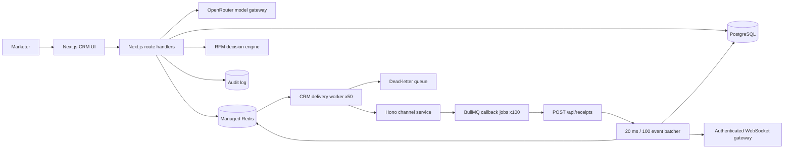

# Xeno Mini CRM

Xeno is a two-service, AI-native campaign operations demo for direct-to-consumer and retail teams. The CRM owns customer and campaign state. The channel service simulates asynchronous delivery receipts.

## Internship Differentiators

- Explainable RFM decision engine ranks customers by conversion probability and expected revenue.
- Churn risk, recommended channel, recommended send hour, and reasons are frozen on every campaign message.
- Seeded offline evaluation compares top-ranked targeting with a deterministic random baseline.
- Randomized 50/50 message experiments report conversion uplift, revenue, confidence, and statistical significance.
- Natural-language segmentation generates schema-constrained, executable audience rules.
- Role-based access supports `ADMIN`, `MARKETER`, and read-only `ANALYST` users.
- Audit logs cover campaign creation, launches, segment creation, imports, and dead-letter retries.
- Redis rate limits protect AI and receipt endpoints.
- Delivery retries use exponential backoff; exhausted jobs move to an administrator-controlled dead-letter queue.
- Real-time campaign updates use a dedicated authenticated WebSocket gateway on port `3001` with short-lived tenant-scoped subscription tokens.
- Docker Compose runs PostgreSQL, Redis, CRM, and the channel simulator locally.

## Architecture



The services deploy independently. PostgreSQL is the business source of truth. Redis is the durable queue and short-lived aggregate cache. Each campaign message receives a stable BullMQ job ID, so retries and repeated launch requests cannot duplicate delivery work.

## Local Setup

Prerequisites: Node 22, PostgreSQL, and Redis.

```bash
cp .env.example apps/crm/.env.local && cp .env.example apps/channel-service/.env
npm install
npm run prisma:migrate --workspace=@xeno/crm
npm run seed
npm run dev
```

Or run the complete stack with containers:

```bash
docker compose up --build
```

The CRM runs at `http://localhost:3000`; the channel simulator runs at `http://localhost:4000`. The default local `DEMO_PASSWORD` is `password`.

The seed creates workspace `xeno` with `admin@example.com`, `marketer@example.com`, and `analyst@example.com`. All three use `DEMO_PASSWORD` and Argon2id hashes.

## Environment

| Variable | Service | Purpose |
| --- | --- | --- |
| `DATABASE_URL` | CRM | PostgreSQL connection string |
| `REDIS_URL` | Both | Managed Redis connection string |
| `OPENROUTER_API_KEY` | CRM | Server-only OpenRouter credential |
| `OPENROUTER_MODEL` | CRM | OpenRouter model slug; defaults to the fast, tool-capable `nvidia/nemotron-3-nano-30b-a3b:free` |
| `OPENROUTER_SITE_URL` | CRM | Optional application URL sent in OpenRouter attribution headers |
| `OPENROUTER_APP_NAME` | CRM | Application name sent in OpenRouter attribution headers |
| `CHANNEL_SERVICE_URL` | CRM | Base URL of the channel service |
| `RECEIPT_HMAC_SECRET` | Both | Shared secret, minimum 32 characters |
| `NEXTAUTH_SECRET` | CRM | NextAuth JWT signing secret |
| `NEXTAUTH_URL` | CRM | Public CRM origin |
| `DEMO_PASSWORD` | CRM seed | Local password hashed with Argon2id for seeded users |
| `E2E_PASSWORD` | Browser tests | Password used by Playwright sign-in helpers |
| `CRM_RECEIPT_URL` | Channel | Public CRM origin; must target the deployed CRM |
| `PORT` | Channel | HTTP port, defaults to `4000` |
| `LOG_LEVEL` | Channel | Pino structured log level |

## Service Contracts

### CRM API

| Method | Route | Behavior |
| --- | --- | --- |
| `POST` | `/api/customers/bulk-import` | Imports JSON or CSV, upserts by `externalId`, rejects bodies over 10 MB |
| `GET` | `/api/customers` | Cursor pagination, search, optional on-demand segment filtering |
| `POST` | `/api/segments` | Validates DSL, counts matches, persists segment |
| `POST` | `/api/segments/ai` | Produces schema-constrained DSL and explanation |
| `POST` | `/api/segments/preview` | Previews unsaved rule-builder DSL |
| `GET` | `/api/segments/:id/preview` | Returns stored count and ten selected customer fields |
| `POST` | `/api/campaigns` | Creates a draft campaign |
| `POST` | `/api/campaigns/:id/launch` | Atomically claims draft, creates messages, queues delivery |
| `GET` | `/api/campaigns/:id/stats` | Returns grouped funnel and conversion aggregates |
| `POST` | `/api/receipts` | Verifies HMAC, records idempotent receipt, invalidates cache |
| `POST` | `/api/ai/chat` | Streams server-side model responses and tool use |
| `GET` | `/api/decisioning` | Ranks customers and returns explainable churn, revenue, and offline benchmark metrics |
| `POST` | `/api/realtime/token` | Issues a short-lived tenant-scoped WebSocket token |
| `POST` | `/api/commerce/orders` | Verifies signed commerce orders and creates idempotent attribution |
| `POST` | `/api/consent` | Applies signed opt-in and unsubscribe events |
| `GET` | `/api/admin/audit` | Returns administrator-only audit history |
| `GET/POST` | `/api/admin/dead-letters` | Lists and safely retries exhausted delivery jobs |

### Channel API

`POST /send`

```json
{
  "messageId": "cm...",
  "recipientPhone": "+15551234567",
  "recipientEmail": "shopper@example.com",
  "channel": "WHATSAPP",
  "message": "Hi Maya, your offer is ready."
}
```

Immediate response:

```json
{ "accepted": true, "externalId": "9ba9535a-8b44-4f5c-a724-87c6640d60a1" }
```

Callbacks are sent sequentially to `${CRM_RECEIPT_URL}/api/receipts` with `x-channel-signature`, an HMAC-SHA256 hex digest of the exact request body. A single random fate value creates a monotonic funnel: 90% delivered, 60% opened, 30% read, and 15% clicked. The remaining 10% receive only `FAILED`.

## Segment DSL

The visual builder and the AI assistant share the same recursive Zod schema.

```json
{
  "operator": "AND",
  "rules": [
    { "field": "totalOrderValue", "operator": "gt", "value": 500 },
    { "field": "lastOrderAt", "operator": "lt", "value": "2026-04-13T00:00:00.000Z" },
    {
      "operator": "OR",
      "rules": [
        { "field": "tags", "operator": "contains", "value": "vip" },
        { "field": "city", "operator": "in", "value": ["Austin", "Miami"] }
      ]
    }
  ]
}
```

Allowed fields are `totalOrderValue`, `lastOrderAt`, `totalOrders`, `tags`, `city`, and `channel_preference`. Allowed operators are `gt`, `lt`, `eq`, `contains`, `between`, and `in`. The executor maps these values explicitly; user-provided Prisma field names are never evaluated.

## AI Tools

```text
create_segment({ name, description, rulesJson })
  -> { id, name, customerCount }

draft_message({ segmentSummary, channel, tone })
  -> { channel, tone, segmentSummary, template }

preview_segment({ segmentId })
  -> { count, customers[5] }

launch_campaign({ campaignName, audience: "all_customers", channel, messageTemplate, confirmed: true })
  -> { campaignId, enqueued, name }
```

The provider-facing `create_segment` tool transports recursive DSL through `rulesJson`; the server parses, normalizes known aliases, and validates it against the canonical recursive Zod schema before querying or persisting. `launch_campaign` never accepts a model-generated campaign ID. After explicit confirmation, it creates the real campaign record and then launches that persisted ID.

Nemotron 3 Nano is accessed through OpenRouter and runs only in server route handlers. It is the default because direct verification showed valid tool calls in seconds, while Nemotron 3 Ultra took roughly 94 seconds and produced invalid DSL for the same request. Set `OPENROUTER_MODEL=nvidia/nemotron-3-ultra-550b-a55b:free` when reasoning quality matters more than demo latency. Chat requests are capped at 60 seconds and dedicated structured generation at 30 seconds because free-tier latency is variable. Tool inputs and structured segment output are schema-validated before execution. The OpenRouter key never reaches the browser.

## Scale and Failure Behavior

- Campaign launch returns `202` after durable enqueue; delivery runs at concurrency 50.
- Channel simulation and callbacks run at concurrency 100.
- Completed queue history is bounded to 1,000 jobs; failed history to 5,000.
- Segment previews use `COUNT` plus a ten-row selected sample, never full materialization.
- Customer listing uses cursor pagination from day one.
- Missing phone or email fails only the affected `CampaignMessage`.
- Channel requests retry three times with exponential backoff.
- Receipt uniqueness is enforced by `(campaignMessageId, event)` in PostgreSQL.
- Receipt webhooks are buffered for up to 20 ms or 100 events and inserted with `createMany`; message status updates are monotonic, so late callbacks cannot regress `CLICKED` to `DELIVERED`.
- Orphan receipts return `200` and emit structured warnings.
- Campaign polling pauses while the browser tab is hidden.
- Channel sends use `CampaignMessage.id` as an idempotency key, so a lost HTTP response cannot create a duplicate provider send.
- Stable hashing preserves A/B assignments across retries and repeated workers.
- AI endpoints are rate limited per forwarded client identity; signed receipt ingestion has a separate high-throughput limit.

## Decision Model and Experiments

The decision engine is deterministic and versioned as `rfm-v1`. It combines purchase recency, order frequency, monetary value, and estimated churn risk. It is intentionally a transparent heuristic rather than a falsely precise trained model because the demo dataset does not contain enough independent outcomes for credible supervised learning.

Two measurements are shown separately:

- Offline benchmark: compares top-ranked customers against a seeded random cohort using historical conversions. This is useful for model evaluation but is not a causal uplift claim.
- Randomized A/B experiment: assigns control and treatment messages 50/50 with a stable hash. A two-proportion z-test reports confidence and only declares a winner at 95% confidence.

## Tests

```bash
npm test
npm run typecheck
npx playwright test
```

Unit coverage includes recursive DSL execution, decision ranking, churn behavior, deterministic cohort assignment, and experiment significance. Integration coverage verifies launch jobs, decision snapshots, variant assignment, signed receipt idempotency, and monotonic receipt progression. Playwright requires both services running and an OpenRouter key for AI scenarios.

See [docs/architecture.md](docs/architecture.md) for security and trade-offs and [docs/demo-script.md](docs/demo-script.md) for the two-minute walkthrough.

## Deployment

Create two Railway projects from this repository. Use `/railway.toml` or `/apps/crm/railway.toml` for the CRM project and `/apps/channel-service/railway.toml` for the channel project. Attach managed PostgreSQL and Redis services to the CRM project and expose the Redis URL to both projects. Set `CHANNEL_SERVICE_URL` to the channel deployment and `CRM_RECEIPT_URL` to the CRM deployment. Both services expose unauthenticated `/health`; migrations run with `prisma migrate deploy` in the CRM container entrypoint. Redis is not containerized with either application.

## Deployment Artifacts

- Local CRM: `http://localhost:3000`
- Local channel simulator: `http://localhost:4000`
- Live URL: pending deployment to the repository owner's Railway account
- Loom walkthrough: pending recording by the repository owner

## Known Limitations

- Tenant isolation is enforced through organization-scoped records and API queries. PostgreSQL row-level security is not enabled, so authorization remains application-enforced.
- Next.js is pinned to the patched 15.5 line. Dependency auditing remains required because AI SDK and authentication transitive advisories may require coordinated major upgrades.
- OpenRouter free-model availability and rate limits can change. Nemotron 3 Nano is pinned for demo responsiveness, but free endpoints are not dependable production infrastructure.
- Conversion events are ingested through the signed `/api/commerce/orders` webhook and attributed to recent campaign clicks.
- Delivery cost events use effective-dated provider rate cards. Final invoice reconciliation and taxes remain outside this demo.
- CSV import supports scalar customer columns; nested orders are intended for JSON import.
- The visual rule editor supports nested groups and row reordering, but it intentionally omits arbitrary canvas positioning.
- Live URL and Loom walkthrough are deployment artifacts and are intentionally not fabricated in this repository.
